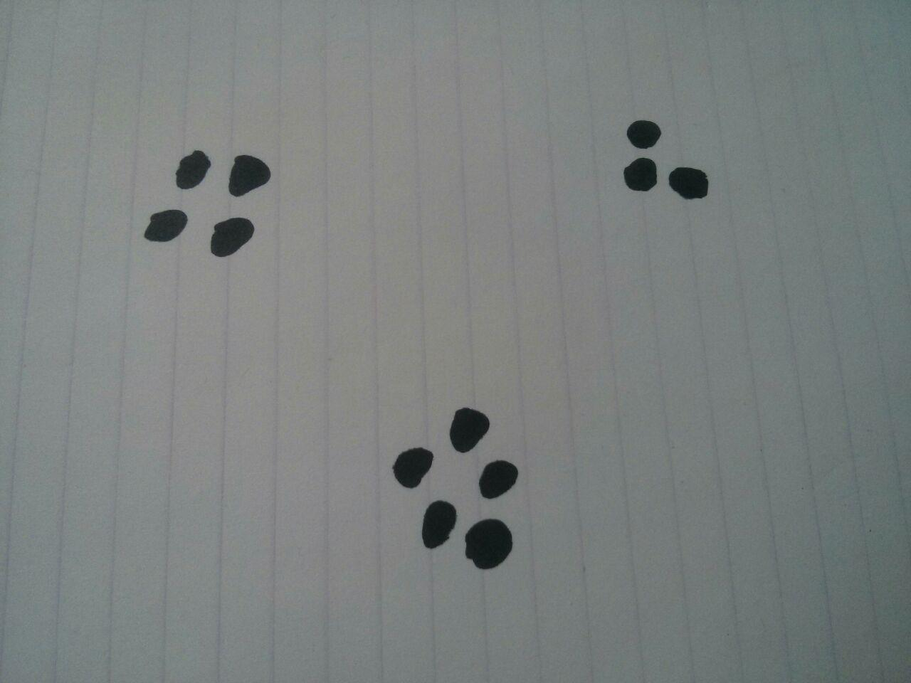

# ARticated
[](./LICENSE)
Master: [](https://travis-ci.org/derpicated/articated)
Devel: [](https://travis-ci.org/derpicated/articated)

An augmented reality application.


This augmented reality application uses ONLY camera images and some fancy math to track markers
across 3D space. It then draws virtual 3D objects as if they were part of reality.

## Developers

This application was developed as an educational project for two
Embedded Systems Engineering students, for their minor in Embedded Vision.
All vision processing, 2D to 3D transformation maths,
and rendering code has been written from scratch by:

-   [Ingmar Delsink](https://github.com/idelsink)
-   [Menno van der Graaf](https://github.com/Mercotui)

## Usage

Open the application, whether it be on desktop or an android phone,
and point the camera so that at least 3 markers are clearly in view.
Press the largest button to set the current position as reference.
Now you can move the camera around, keeping at least 3 markers in view.

## Markers

The application needs to track at least 3 unique markers to calculate the camera movement, although more can be used.

These markers are loosely defined groups of black dots on a white background.
The markers are identified by their dot count, so these have to be unique.
A minimum of 2 and a maximum of 9 dots are required for a marker to be valid.

See below, the markers can be drawn by hand. This configuration features marker #3, #4, and #5. Make sure to leave plenty of white-space between each marker, so they don't merge together.



## Dependencies

### Dekstop

-   Qt 5.7
-   OpenGL 4.1

### Android

-   Qt 5.7
-   OpenGL-ES 3.0
-   Android SDK + NDK

## Tested

Tested on:

-   Ubuntu 14.04.3 LTS ([See Travis-ci](https://travis-ci.org/derpicated/articated))
-   Fedora 24
-   Android 5.1.1 and 6.0.1

## Building

### Desktop

When building this application for desktop, pass the following CMake variables:

-   `Qt5_DIR`: Qt5 path

#### Example


```sh
mkdir build && cd build
cmake .. -DQt5_DIR=/home/user/Qt/5.7/gcc_64/lib/cmake/Qt5
```

### Android

When building this application for Android, pass the following CMake variables:

| Variable            | Type   |
|:--------------------|:-------|
| Qt5_DIR             | PATH   |
| QT_ANDROID_SDK_ROOT | PATH   |
| QT_ANDROID_ANT      | PATH   |
| ANDROID_NDK         | PATH   |
| JAVA_HOME           | PATH   |
| ANDROID             | ON/OFF |

#### Example

```sh
mkdir build && cd build
cmake .. \
-DANDROID=ON \
-DQt5_DIR=/home/user/Qt/5.7/android_armv7/lib/cmake/Qt5 \
-DQT_ANDROID_SDK_ROOT=/home/user/.local/android-sdk-linux \
-DQT_ANDROID_ANT=/usr/bin/ant \
-DANDROID_NDK=/home/user/.local/android-ndk-r13b \
-DJAVA_HOME=/usr/lib/jvm/java-1.8.0-openjdk-1.8.0.111-3.b16.fc24.x86_64
```

### Extra note

When switching targets, make sure to delete the old build files. So an
`rm -rf ./` on the build directory would suffice. Or for convenience, two build
folders can be made, one for android and one for desktop. This way switching to
a different target is a mere switching of directories.

## License

> You can check out the full license [here](./LICENSE)

This project is licensed under the terms of the **MIT** license.
