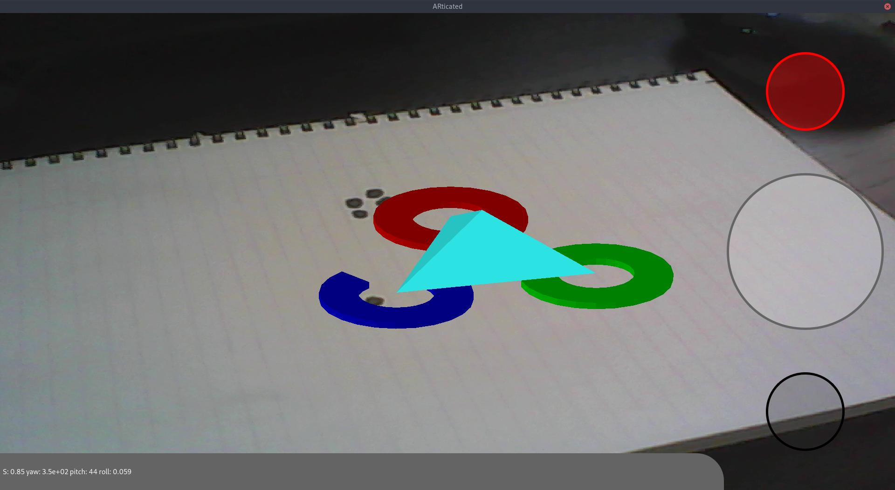
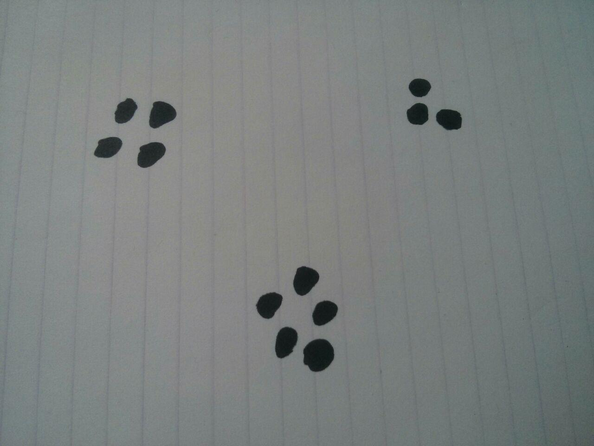

# ARticated

[](./LICENSE)


An augmented reality application.



This augmented reality application uses ONLY camera images and
some fancy math to track markers across 3D space.
It then draws virtual 3D objects as if they were part of reality.

## Developers

This application was developed as an educational project for two
Embedded Systems Engineering students, for their minor in Embedded Vision.
All vision processing, 2D to 3D transformation maths,
and rendering code has been written from scratch by:

- [Ingmar Delsink](https://github.com/idelsink)
- [Menno van der Graaf](https://github.com/Mercotui)

## Usage

Open the application, whether it be on desktop or an android phone,
and point the camera so that at least 3 markers are clearly in view.
Press the largest button to set the current position as reference.
Now you can move the camera around, keeping at least 3 markers in view.

## Markers

The application needs to track at least 3 unique markers to calculate
the camera movement, although more can be used.

These markers are loosely defined groups of black dots on a white background.
The markers are identified by their dot count, so these have to be unique.
A minimum of 2 and a maximum of 9 dots are required for a marker to be valid.

See below, the markers can be drawn by hand.
This configuration features marker #3, #4, and #5.
Make sure to leave plenty of white-space between each marker,
so they don't merge together.



## Dependencies

To build ARticated, you need the following:

- Qt 5.14
- OpenGL 4.1

### On Fedora

Install the following libraries on Fedora:

```sh
dnf install \
  qt5-qtbase-devel \
  qt5-qtbase-gui \
  qt5-qtquickcontrols2-devel \
  qt5-qtmultimedia-devel

```

## Building

Also see [Building For Android](docs/building-android.md).

When building this application for desktop, pass the following CMake variables:

| Variable           | Type | Description                   |
|:-------------------|:-----|:------------------------------|
| Qt5_DIR (Optional) | PATH | Path to the Qt CMake directory|

### Example

```sh
mkdir build && cd build

cmake .. -DQt5_DIR=/home/user/Qt/5.7/gcc_64/lib/cmake/Qt5

make
```

## License

> You can check out the full license [here](./LICENSE)

This project is licensed under the terms of the **MIT** license.
