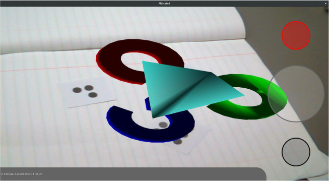

# ARticated
Master: [](https://travis-ci.org/derpicated/articated)
Devel: [](https://travis-ci.org/derpicated/articated)

An augmented reality application.



## Dependencies

-   Qt 5.7

## Tested

Tested on:

-   Ubuntu 14.04.3 LTS ([See Travis-ci](https://travis-ci.org/derpicated/articated))
-   Fedora 24

## Building

### Desktop

When building this application for desktop, pass the following CMake variables:

-   `Qt5_DIR`: Qt5 path
-   `ANDROID`: [ON/OFF] android build

#### Example


```sh
mkdir build && cd build
cmake .. \
-DQt5_DIR=/home/user/Qt/5.7/gcc_64/lib/cmake/Qt5 \
-DANDROID=OFF
```

### Android (not working)

When building this application for Android, pass the following CMake variables:

-   Qt5_DIR
-   QT_ANDROID_SDK_ROOT
-   QT_ANDROID_ANT
-   ANDROID_NDK
-   JAVA_HOME
-   ANDROID [ON/OFF]

#### Example

```sh
mkdir build && cd build
cmake .. \
-DQt5_DIR=/home/user/Qt/5.7/android_armv7/lib/cmake/Qt5 \
-DQT_ANDROID_SDK_ROOT=/home/user/.local/android-sdk-linux \
-DQT_ANDROID_ANT=/usr/bin/ant \
-DANDROID_NDK=/home/user/.local/android-ndk-r13b \
-DJAVA_HOME=/usr/lib/jvm/java-1.8.0-openjdk-1.8.0.111-3.b16.fc24.x86_64
```

### Extra note

When switching targets, make sure to delete the old build files. So an
`rm -rf ./` on the build directory would suffice. As an example, two build
folders can be made, one for android and one for desktop. This way switching to
a different target is a mere switching of directories.

## License

> You can check out the full license [here](./LICENSE)

This project is licensed under the terms of the **MIT** license.
